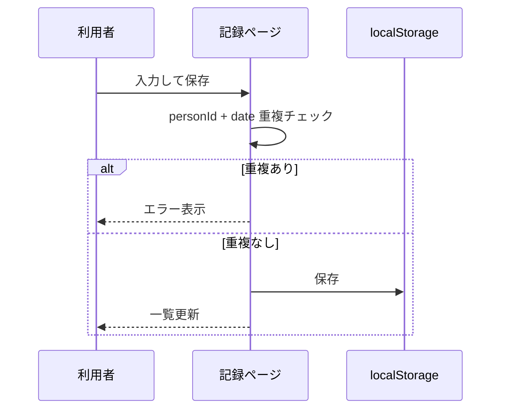

# シーケンス図

## 記録保存

```mermaid
sequenceDiagram
  participant U as 利用者
  participant P as 記録ページ
  participant LS as localStorage
  U->>P: 入力して保存
  P->>P: personId + date 重複チェック
  alt 重複あり
    P-->>U: エラー表示
  else 重複なし
    P->>LS: 保存
    P-->>U: 一覧更新
  end
```
